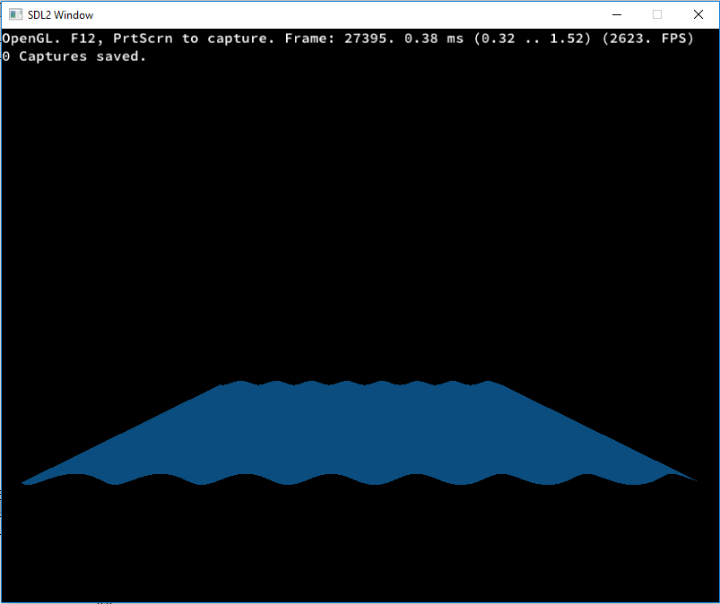

# COMP 220 Worksheet C

## Goal
The goal is to create a realistic ocean scene with reflections from the sun.

## Benchmark

### Base system for benchmarks
 - CPU : AMD Ryzen 1600 (6 cores 12 threads) @ Stock clocks (3.2GHz all core, 3.6GHz single core boost)
 - GPU : Nvidia GeForce Asus Strix GTX 970 (1664 Cuda cores, 3.5GB VRAM @ 7010 MHz + 500MB slower) @ Factory overclocked (1114 MHz base, 1253 MHz boost)
 - RAM : 2x 8GB Corsair LPX 3000MHz @ 2933MHz (16-17-17-35-52)
 - Drive : Samsung 850 Evo 500GB (Set to "Maximum Reliability" in Samsung Magician - Read/Write - 549/520 MB/s - 53880/43929 IOPS)
 - OS : Windows 10 64bit

### Test
So far I have only scratched the surface of profiling, looking at the frame rate and getting use to the interface after the profiling has been completed. It looks as if there are no major bottlenecks so far as the frame rate is over 2.5k.

## Plan
I need to separate the video tutoruals/stuff done in lessons more from the worksheet through better use of branches and also catchup with generally. 

### Todo
- Get a light reflection off of a static water texture
- Make it then work when the water is being animated
- Refactor code
- Look into more realist wave simulation and apply it to the project
- Add a skybox
- Add physics collisions to the waves so the camera can bob on top

Useful links:
	http://in2gpu.com/2015/02/25/create-a-game-engine-part-i-shader-manager/
	http://in2gpu.com/category/game-development/opengl/
	http://madebyevan.com/webgl-water/
	https://github.com/evanw/webgl-water
	
