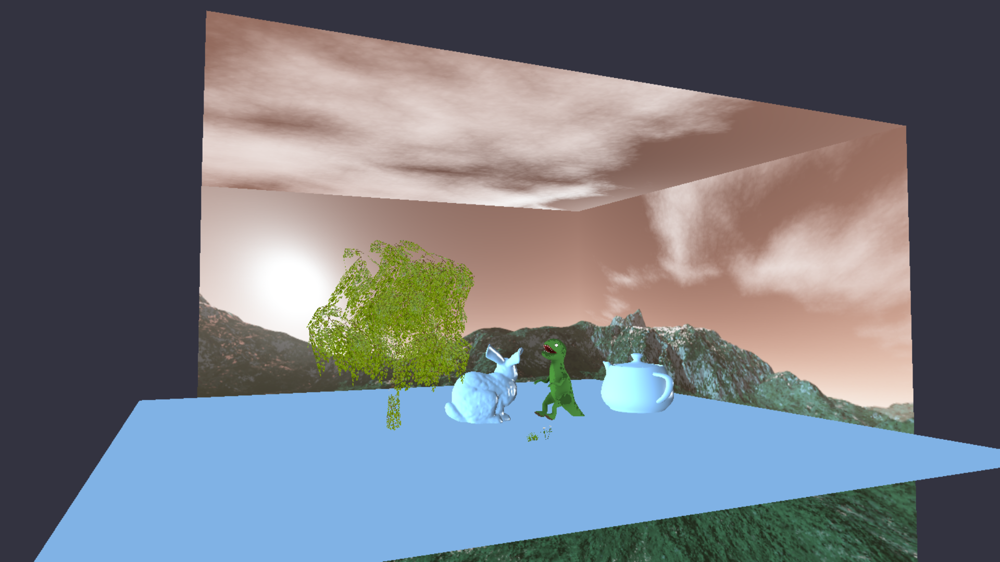
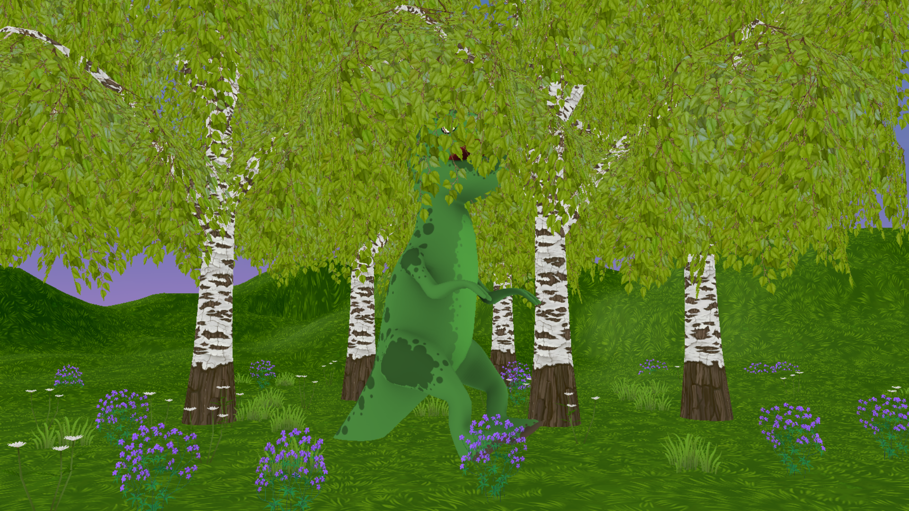

# comp220-worksheetA 

## Controls
- WASD to move around
- LShift to move faster
- LCtrl to go down
- SpaceBar to go up
- 0 key to change skybox textures

## What's being shown in the Demo
My graphics demo is trying to portray a small calm forest scene that feels alive.

My graphics demo shows a small forest that was constructed from free assets I found online.
The enviroment models are placed arond the scene psuedo randomly to make it look more natural.
The leaves of the trees and the foliage on the ground (the grass and 2 types of flowers) have a vertex shader apllied to them to simulate the effect of wind blowing through them.

the assets used:
- https://assetstore.unity.com/packages/3d/environments/fantasy-landscape-103573
- https://assetstore.unity.com/packages/2d/textures-materials/sky/colorskies-91541

I also left in my custom dinosaur model in the scene.

========================================================================

List of things to add:
- Shift button press speedx2 -- DONE
- easy model laoding (lots of code refactoring)
- easy shader asignment (lots of code refactoring)
- Vertex animation shader (for grass and leaves) -- DONE
- Sky box -- DONE
- find 3D models for the scene -- DONE
- create a GraphicsApplication class that inherits from the game class and deals with the scene and gameobjects -- DONE
- Add the rock model into the scene
- function to change skybox on key press -- DONE (needs refactoring)

## WorkSheet C
Screenshot from using RenderDoc

Grass model taken from: https://sketchfab.com/models/4fc117d6a23441bf803bef56e378f098
More assets I'm planning on using: https://assetstore.unity.com/packages/3d/environments/fantasy-landscape-103573

Resources used to get the grass shader working:
- https://twitter.com/minionsart/status/894576554411470848
- https://lindenreid.wordpress.com/2018/01/07/waving-grass-shader-in-unity/

Grass shader gif:

Plan for the next Iteration:
- Make a skybox handled by it's own class -- DONE
- Make a new vertex shader that works on the leaves of a tree model -- DONE
- further refactoring of the code that handles textures and models
- Add more models to construct a small forest to move around in // instancing // rand function -- DONE

## WorkSheet D
Screenshot from the latest version of my graphics application

Gif of the wind effect in play on the foliage in the scene

