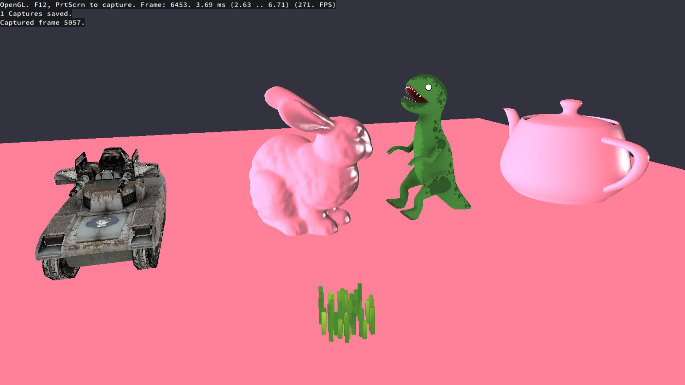

# comp220-worksheetA 

List of things to add:
- Shift button press speedx2
- easy model laoding (lots of code refactoring)
- easy shader asignment (lots of code refactoring)
- Vertex animation shader (for grass and leaves) -- Done for grass
- Sky box
- Collision Detection
- find and or make 3D models for the scene -- Almost Done
- create a GraphicsApplication class that inherits from the game class and deals with the scene and gameobjects -- Done

Screenshot from using RenderDoc

Grass model taken from: https://sketchfab.com/models/4fc117d6a23441bf803bef56e378f098
More assets I'm planning on using: https://assetstore.unity.com/packages/3d/environments/fantasy-landscape-103573

Resources used to get the grass shader working:
- https://twitter.com/minionsart/status/894576554411470848
- https://lindenreid.wordpress.com/2018/01/07/waving-grass-shader-in-unity/

Grass shader gif:

Plan for the next Iteration:
- Make a skybox handled by it's own class
- Make a new vertex shader that works on the leaves of a tree model
- further refactoring of the code that handles textures and models
- Add more models to construct a small forest to move around in
