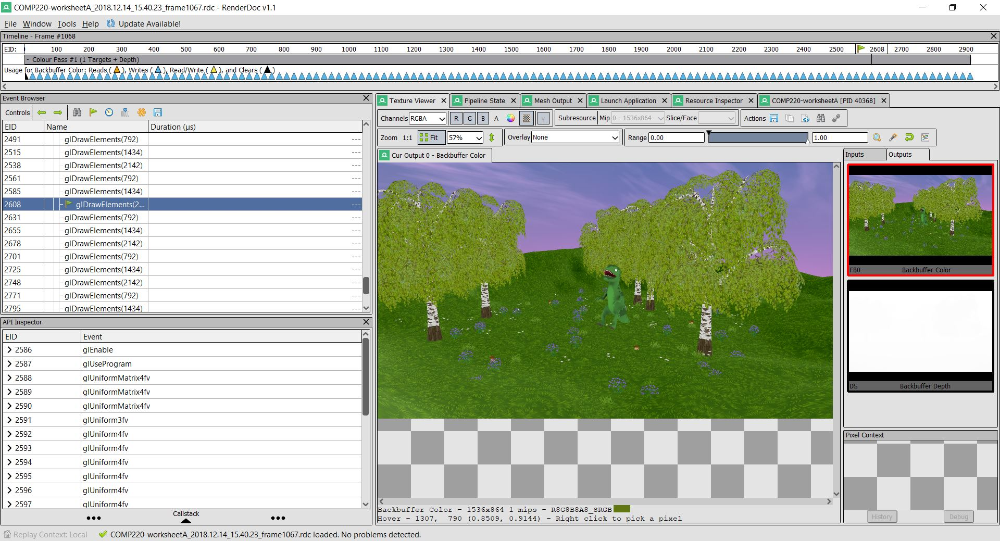
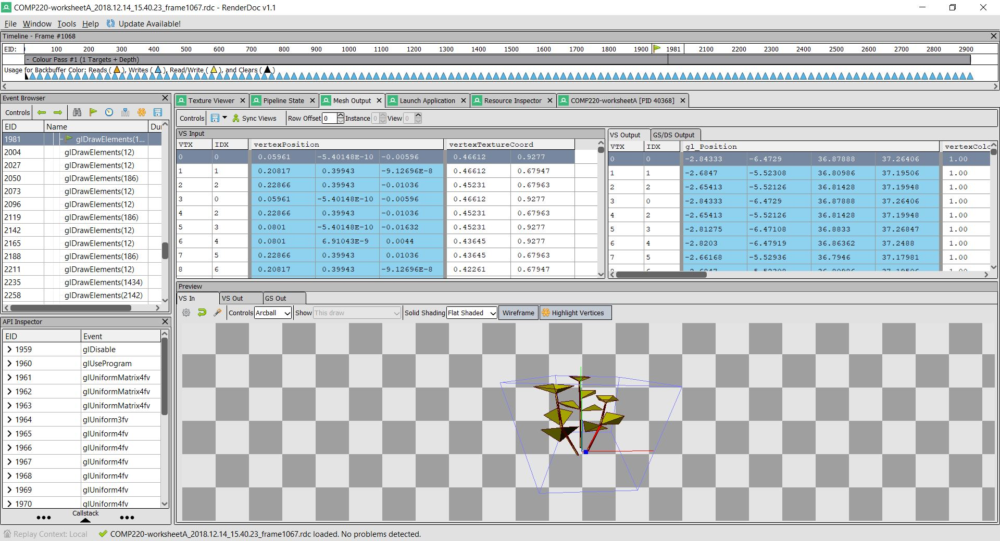

# comp220-worksheetA 

List of things to add:
- Shift button press speedx2
- easy model laoding (lots of code refactoring)
- easy shader asignment (lots of code refactoring)
- Vertex animation shader (for grass and leaves) -- DONE
- Sky box -- DONE
- find 3D models for the scene -- DONE
- create a GraphicsApplication class that inherits from the game class and deals with the scene and gameobjects -- DONE

## WorkSheet C
Screenshot from using RenderDoc

Grass model taken from: https://sketchfab.com/models/4fc117d6a23441bf803bef56e378f098
More assets I'm planning on using: https://assetstore.unity.com/packages/3d/environments/fantasy-landscape-103573

Resources used to get the grass shader working:
- https://twitter.com/minionsart/status/894576554411470848
- https://lindenreid.wordpress.com/2018/01/07/waving-grass-shader-in-unity/

Grass shader gif:

Plan for the next Iteration:
- Make a skybox handled by it's own class -- DONE
- Make a new vertex shader that works on the leaves of a tree model -- DONE
- further refactoring of the code that handles textures and models -- partially done
- Add more models to construct a small forest to move around in // instancing // rand function -- DONE

## WorkSheet D
For Worksheet D I worked on creating the intended scene I wanted to create for the final outcome of this Graphics Application
I created a a skybox, that can be swapped out for different skyboxes quite easily.
I managed to get multiple textures working on a single model, this still need to be refactored quite a bit.

Screenshot from working on the Skybox

Screenshots from the latest version of my graphics application

#### Gif of the wind effect in play on the foliage in the scene

Renderdoc Screenshots

